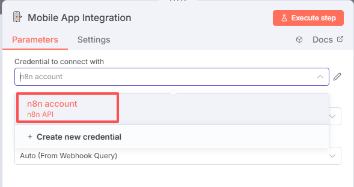

# n8n 移动端应用
[English Documentation](README.md)

一款用于随时随地监控和管理 n8n 工作流的移动应用，让您的自动化流程管理更加便捷高效。

> **重要提示**：
> - 请重点关注：【最最最重要的安全设置】部分
> - 本项目默认不支持商用，仅供个人学习和使用
> - 商业环境使用需求：请联系作者获取正式授权
> - 安全考量：若您对数据安全有顾虑，请不要使用本项目，禁止将本项目用于任何商业敏感场景
> - 免责声明：个人使用过程中产生的任何问题，作者不承担相关责任

## 功能特性

- 查看和监控您的 n8n 工作流
- n8n 服务器连接设置，包括服务器地址、认证方式
- 安全认证支持（Basic、Header、JWT）
- 工作流卡片颜色状态指示器：
  - 运行中状态：绿色背景+绿色指示器
  - 活动状态：绿色背景+绿色指示器
  - 已暂停状态：灰色背景+灰色指示器
  - 无法激活状态：灰色背景+灰色指示器
- 查看指定工作执行日志和结果
- 查看指定工作流节点详情
- 快速启用/禁用工作流
- APP密码锁功能，保护您的应用安全
- 所有设置和数据都存储在本地设备上，不会上传到任何服务器
- 错误日志记录及查看，便于问题排查

## 安装与使用

### 1. n8n 安装社区节点
请在 Settings 下面的 Community nodes 中搜索并安装`n8n-nodes-mobile`节点

### 2. n8n 端配置

#### 2.1 导入工作流
新建空白工作流，并导入：`n8n-reference-demo.json`

#### 2.2 配置 API 凭证
新建或添加 n8n API credentials：

确保两个 Mobile App Integration 都配置好。

#### 2.3 ⚠️ 【最最最重要的安全设置】配置认证方式 ⚠️

> **安全警告**：这是保护您的工作流成果的最最最重要的一步！请务必设置安全的认证凭证。

在两个 Webhook 配置您的 Authentication 方式：

1. 选择一个授权方式（推荐使用 Basic Auth）
2. 新建一个 credentials
3. **设置一个复杂的用户名和密码**，避免使用简单密码

#### 2.4 激活工作流
完成上述配置后，激活 Active 此工作流：

### 3. 移动端下载
下载 NextFlow APP
请到本项目Github的Release页面下载最新版本的NextFlow APP

### 4. 移动端配置

1. 打开 NextFlow APP，点击"设置"图标
2. 在"设置"页面，点击"n8n服务器URL"的编辑按钮，输入您的 n8n 服务器地址
3. 在"设置"页面，点击"认证设置"的编辑按钮，选择您在 n8n 端配置的认证方式，点击"用户名"和"密码"，输入您在 n8n 端配置的用户名和密码
4. 如果 URL 地址、认证方式、用户名和密码都正确，则会在工作流列表显示 n8n 端的工作流

## 注意事项

- 请确保您的 n8n 服务器可以从外部网络访问（如果您想从非本地网络使用）
- 定期更新密码以保证安全性
- 所有设置和数据都存储在本地设备上，不会上传到任何服务器

## 故障排除

- **连接失败**：请检查 n8n 服务器 URL 是否正确，网络连接是否正常，认证信息是否正确
- **工作流不显示**：确保您已正确配置认证信息并且工作流已激活
- **应用崩溃**：尝试清除应用数据或重新安装应用

## 作者

- **hundred98** - hundred98@163.com

## 仓库

- GitHub: https://github.com/hundred98/NextFlow

## 邮箱支持

- 您可以通过发送邮件到 hundred98@163.com 与我联系
- 我会尽力回复您的问题，但请允许一些延迟，因为我可能有其他工作要处理

## 📱 微信支持

如果您有任何问题或建议，欢迎关注我的微信公众号获取技术支持：

  
   
  <em>扫码关注微信公众号</em>

